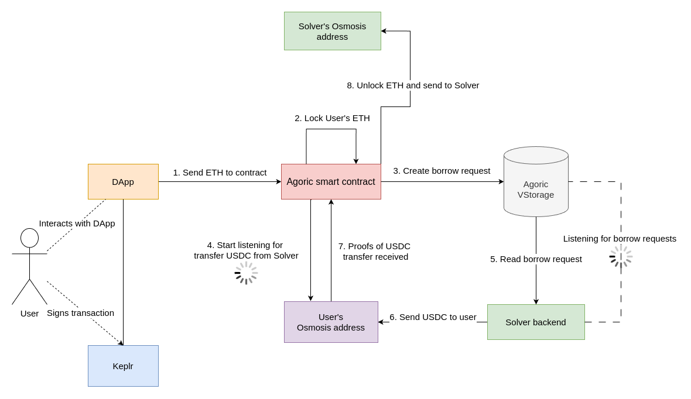
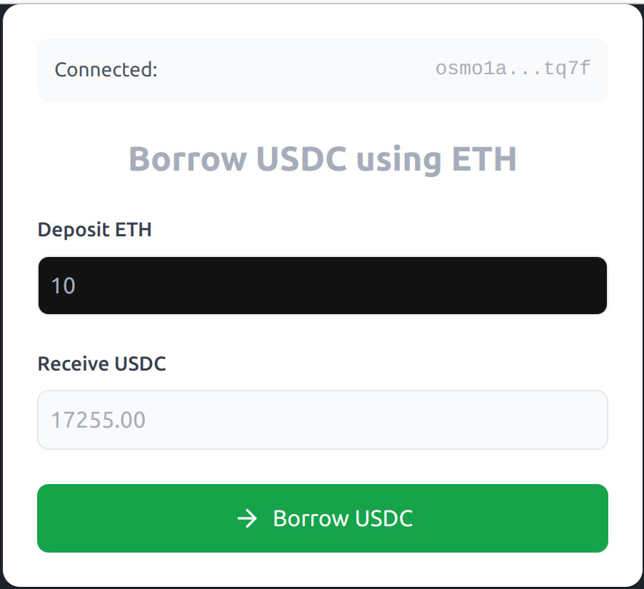

### ZeroMile

ZeroMile enables Defi dapps to go cross chain with concentrated liquidity with its unique intent based system that does not require bridges or any other messaging layer.

in the MVP we tried to make DApp to borrowing USDC by ETH

https://docs.google.com/presentation/d/1APtsZOgxYNlUA4yWOvJ4cM14t9rtCgfi7CkNYBN5Alw/edit?usp=sharing

### MVP:
- We develop smart contract on agoric for borrowing USDC by ETH on osmosis chain.
- User deposit ETH from osmosis wallet to agoric smart contract and will receive USDC to his osmosis wallet.
- Smart contract must lock ETH until Solver transfer USDC to User's osmosis wallet.
- Solver works as market maker temporarily. Solver handle user borrowing requests and send USDC to User's osmosis wallet.

### MVP Architecture

### Whitepaper

https://docsend.com/view/bchs8x3anb9wpcws

### Components:

Interface:
- User login with keplr wallet
- User see form:
    - Title: Borrow USDC using ETH
    - Deposit ETH: input with amount of ETH
    - Receive USDC: calculated USDC amount: ETH_USDC_PRICE * ETH_AMOUNT_IN_INPUT
    - Button: "Borrow USDC"
- User press "Borrow USDC" button
    - User will send ETH to Agoric smart contract where ETH will be locked
    - System asks User for sign transaction in Keplr wallet
    - System starts borrowing process
    - After borrowing process finished User receive USDC to his Osmosis wallet

Borrowing process in Agoric smart contract:
- User send ETH to smart contract
- Smart contract lock User's ETH
- Smart contract save User's borrow request to Agoric vstorage for further usage by Solver offchain logic
- Smart contract starts listening for USDC deposit from Solver to User wallet for 15 minutes
    - If Solver sent USDC to User wallet system unlock ETH from smart contract and send to Solver wallet
    - If Solver didn't send USDC in 15 minutes we unlock ETH from smart contract and send back to User

Solver offchain backend logic:
- Our offchain backend listening to agoric smart contract Vstorage about new User's borrow request
- Our backend notify Solver for providing USDC to User osmosis waller
- Solver send USDC to User osmosis wallet

### UI

